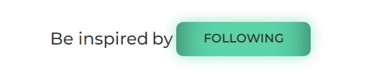

This project was created with [Create React App](https://github.com/facebook/create-react-app).

HTML markup is fixed in px, semantic and valid.

According to the layout (https://www.figma.com/file/zun1oP6NmS2Lmgbcj6e1IG/Test?node-id=0%3A1&t=VoiY
TfiXggVItgVd-1), user cards were implemented.
Clicking on the Follow button triggers a change in the button's text and color, as well as an update in the number of followers. The user's actions are saved and displayed even after the page is reloaded. Clicking the button again restores it to its original state and updates the number of followers accordingly.

Created routing using React Router.
'/' – home page.
'/tweets’ - tweets page.

The backend was created using the mockapi.io service.
